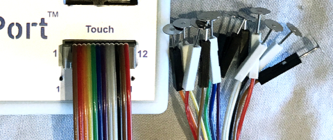
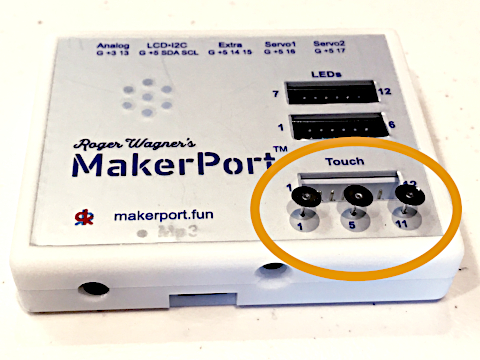
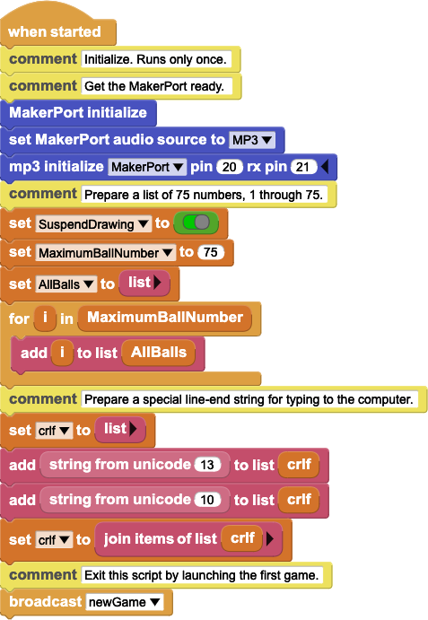
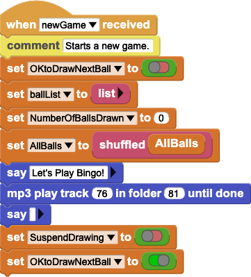
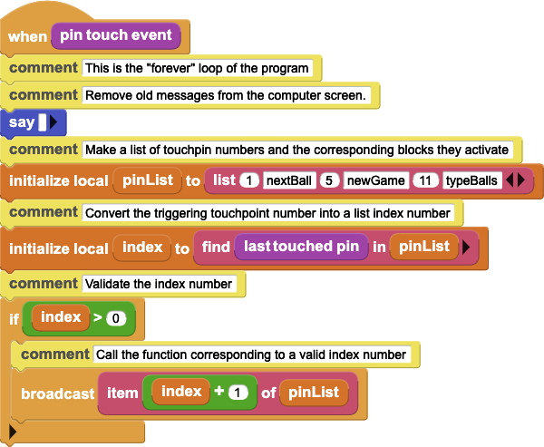
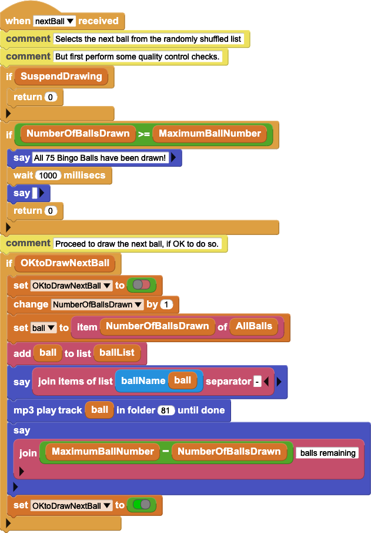
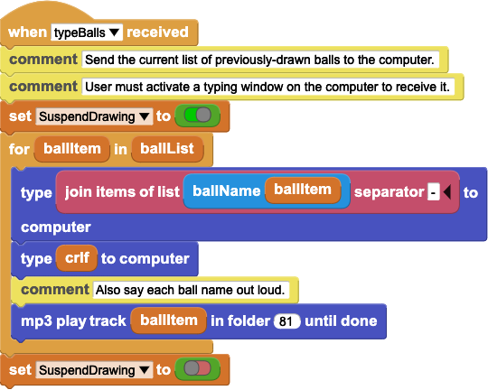
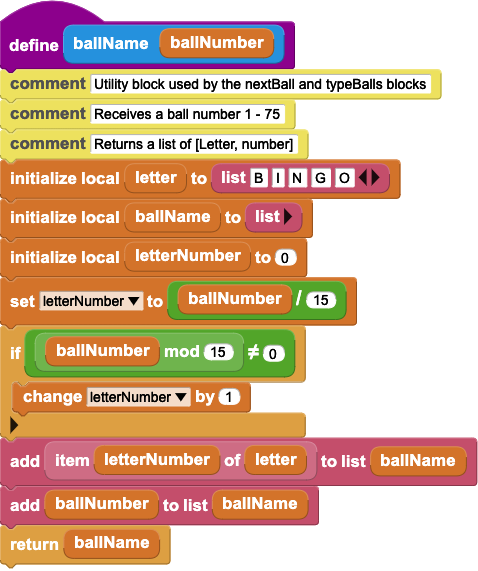

# Bingo-MakerPort-MicroBlocks

## Let's Play Bingo!
Make an interactive, audible Bingo game caller using MicroCode with Roger Wagner's MakerPort.

To build this project you will need:

* a MakerPort
* three "touchpoints", explained below
* optional microSD card to contain audio files
* USB-C cable connection to a computer
* MicroBlocks IDE, either by:
    * installing the standalone IDE on a compatible computer, or
    * using a Web browser capable of running the free online IDE [available through this link](https://microblocks.fun/run-pilot/microblocks.html).
* optional accessory power supply, when you want to run the game without a computer connection.

## Contents


## Introduction
### The MakerPort
You've heard the saying, "Hey, Take It Easy"? 

Now there's a new saying, "Hey, Make It Easy!"

A wide variety of different displays, sensors, lights and motors can plug directly into a MakerPort. It's like an Arduino that doesn't need shields because it has ports instead. It's like a USB hub designed for Makers. 

Suppose you want to make something that interacts with people or controls something, but without the need to wire up a circuit board. Make It Easy, with a MakerPort.

Even more, it contains an MP3 audio player and built-in speaker. This project uses the feature to say the names of the Bingo balls out loud.

The MakerPort is built around the same, advanced microcontroller as the modern Arduino Zero. It can be programmed using the Arduino IDE, but that is not necessary. This project demonstrates an accessible and user-friendly alternative, called MicroBlocks.

### MicroBlocks
This is a graphical programming language. Users build programs by selecting and connecting colorful "blocks", similar to the popular Scratch and Snap! In fact, some of the same people who originated those two languages are leading the development of MicroBlocks.

A very nice feature of MicroBlocks is how the blocks read like instructions given in a natural, human language. Incidentally, MicroBlocks is available in 16 major, world languages.

Extensive documentation is available at [the dedicated MicroBlocks Wiki site](https://wiki.microblocks.fun/en/home). 

The Wiki includes a User Guide that covers all the basics. 

---

NOTE TO REVIEWERS: I am considering adding the following.

For newcomers to MicroBlocks and MakerPort, here is a link to a separate, [introductory tutorial] showing how to use MicroBlocks to blink an LED plugged into a MakerPort. No circuit board required!

---

### The MakerPort Library
MicroBlocks supports many different Maker devices. You can customize the language by adding a Library.

Install the MakerPort library by following these links in the MicroBlocks editing window: +Library > Kits and Boards > MakerPort.

### All About Touchpoints
A touchpoint is a physical object that works as a kind of electronic pushbutton. Merely touch it. The MakerPort will detect the touch and activate code you write to respond to it.

Almost anything metallic or moist can be a touchpoint: an empty tin can or piece of aluminum foil will do nicely; you can even use fruit. MakerPort includes a port for connecting up to 12 of these versatile sensors through wires. For example, see Figure 1.


**Figure 1**

This project uses inexpensive earring backs, commonly available in the jewelry-making area of craft stores. Their small size and uniform shape makes them especially suitable for interactive displays. 

In this project, we insert three touchpoints into special, extra ports provided on the MakerPort enclosure itself. Figure 2 illustrates their placement. No further wiring is required, except to connect a power source to the MakerPort.


**Figure 2**

### Optional Audio
The example code provided for this project takes advantage of the MakerPort's MP3 player and built-in speaker.

Copy the folder named "81" from this GitHub repository onto a microSD card. Install the card into the MakerPort. Important: slide the small switch on the side of the MakerPort so it is closest to the USB socket. This position enables the MP3 player to access the files on the microSD card. 

## How the Program Works
Copy the example program from this repo to your computer then open it in the MicroBlocks editing window.

Each of the three touchpoints initiates a different action:

* Start a new game.
* "Draw" and announce one "ball". Repeated touches select successive ball numbers.
* List all of the balls that have been drawn so far in the current game. Touching again repeats the list including balls added since the previous touch.

Six, separate "scripts" make up the program. A script is a list of blocks connected together under a "hat". The hat identifies the script and tells MicroBlocks when to run the code in it. 

Each script performs just one action. Five of them respond to user actions, such as touching a touchpoint. The sixth defines a "helper" function that runs when one of the other scripts call for it.

MicroBlocks activates the scripts as needed to create the game experience.

### When Started
This script runs when power is switched on to the MakerPort. Also, it runs when the MakerPort is connected to the MicroBlocks IDE and the user clicks the green triangle "Start" icon.



The script suspends the game while it completes three, one-time tasks to get things started:

* Prepare the MakerPort to use its MP3 player.
* Create a list of 75 items, numbered 1 through 75 just like the balls in Bingo.
* Make a special line-end string for optional use when typing text to a computer.

It then launches the first game by broadcasting the "newGame" message. What does "broadcast" mean?

To this old programmer's mind, it resembles the ancient "goto" or "jmp" instruction. Program execution will continue from the target location. In this case, it activates the ```when newGame received``` script, described next.

However, there is a difference. The old-timey "goto" specifies just one destination. By contrast in MicroBlocks, more than one script in a program can receive and act upon a message. 

It would be an interesting learning experience to invent such a program. But just-because-you-can doesn't mean you should, and this program does not use the feature. 


### When NewGame Received
This is one of three scripts that "listen" for messages broadcast by other scripts. As its hat proclaims, it starts a new game.



It shuffles the ```AllBalls``` list of 75 numbered items into a random order. The effect is the same as if someone drew out all of the balls, one after another, from the hopper in a physical Bingo game and arranged them along a tray in the order they were drawn.

Then the script initializes a second such "tray" called ```ballList``` that is empty at first. Another script in the program will effectively "move" balls from the shuffled ```AllBalls``` list into this ```ballList```. 

As this is a new game, the number of balls drawn is set to zero.

Then it announces that the time has come to play Bingo!

The script finishes by re-enabling the main purpose of the program, drawing Bingo balls.

At this point, nothing further will happen until a human being touches a touchpoint.

### When PinTouch Event
This is the script that interacts with human users. Most of the time it does nothing but wait. It will wait "forever", meaning as long as the electricity stays on.



As the hat says, this script runs when a user touches a touchpoint. "Pin" is another name for a touchpoint in this context. 

How does the script know when a pin has been touched? Through the magic of MakerPort. 

The MakerPort hardware tells the MicroBlocks program. Well, to be precise, it informs the "pin touch event" block in the MakerPort library. That block, in turn, tells the script that it's time to run.

The script is short. It sets up a list that works like a dictionary. The items are arranged in pairs: a number, followed by a text string. 

It gets the number of the ```last touched pin``` from the MakerPort library and saves it as an index into the dictionary list.

So, we have three numbers (1, 5 and 11), each paired to three text strings. Where does the number come from?

The gray socket on the MakerPort provides 12 places to plug in a touchpoint, numbered 1 through 12. In addition, the three special spots on the enclosure also plug into positions 1, 5 and 11. 

MicroCode looks up the pin number number and broadcasts the corresponding text string. Study the example code until it become clear to you which touchpoint triggers each action:

* #1 draws a new ball.
* #5 starts a new game.
* #11 outputs the ```ballList```, informing users of which balls have been drawn so far in the game.

What happens next depends on which string gets broadcast, as determined by which pin was touched.

Other programming languages might refer to this technique as a "jump table" or a "switch / case statement". Another way to do the same thing would be by a sequence of "if-then" statements. The approach here takes advantage of MicroBlocks's strength with lists and concurrency.

What is "concurrency?" It's explained [at this link about Tasks in the Wiki](https://wiki.microblocks.fun/en/virtual_machine#tasks).

### When NextBall Received
Here is the main job of the script. It responds to touchpoint #1.



The first thing it does is to check whether game action has been suspended, or if all 75 numbers have been drawn out of the ```AllBalls``` list into the ```ballList```. It exits if either condition is true.

Next it checks to see whether ball-drawing has been paused. This check makes sure that only one touch at a time on pin #1 gets processed, and then only when the program is not busy doing something that should not be interrupted. 

The benefit of "semaphores", such as the ```OKtoDrawNextBall``` block, is explained in the link about Tasks and concurrency, given above.

When it is OK to draw the next ball then the script increases the ball count by 1. It uses the count to "draw" the next ball from the shuffled ```AllBalls``` list and assign its number to the ```ball``` block. 

The ball number is added to the ```ballList``` and then used to announce the name of the ball to the users. It makes the announcement two, different ways.

* The ```say``` block shows it on the computer screen when the MakerPort is connected to the MicroCode IDE.
* ```mp3 play track``` selects an audio file from the microSD card and plays it through the built-in speaker.

Finally, the script displays the number of balls that have not yet been drawn. This information appears only on the computer screen. It does not get read out loud through the MP3 player.

Its work being complete, the script exits. 

MicroCode waits for the user to touch another touchpoint.

### When TypeBalls Received
This script illustrates how the ```for ... in ...``` block of MicroBlocks sequentially processes each item in a list. Not every programming language makes it this easy.

---
NOTE TO REVIEWERS

It also illustrates how to type information into a window on a connected computer.

I feel indifferent about whether this feature belongs in an introductory project.
--- 



At times during a Bingo game, the players might want to review which balls have already been drawn. They will surely want to check whenever someone shouts "Bingo!"

Touching pin #11 activates this script to report the state of the game. It suspends drawing new balls while it does so.

Remember that the "items" in ```ballList``` are just numbers between 1 and 75. Item 1 is whichever number was drawn first, and so forth.

The script steps through all of the items in ```ballList``` in order, starting with item #1. The ```ballItem``` block receives the numerical value of that item. 

Suppose item #1 had the value 42. ```ballItem``` would be assigned the value 42. It would be audibly announced as "O-42". It would also be typed into a window on a connected computer.

Then the next item's value would be assigned to ```ballItem```. The sequence repeats until all items in ```ballList``` have been reported to the players.

The script finishes by re-enabling ball-drawing and the game resumes.

To start a new game, players have to touch pin #5.


### Define BallName
This is a "reporter block", so called because it reports a result at the end. 

It illustrates how MicroBlocks manipulates strings.



It receives a number in the range 1 through 75 and returns a text string joining the number to its column on a Bingo game card. For example, it knows to join '42' with the letter "O", returning "O-42".

It's a separate script because two of the other scripts need this done. Write once, use many times. Other programming languages would call it a subroutine or a procedure.

Study how the ```join``` block turns numbers into strings and concatenates (joins together) different parts of a string. It is the MicroBlocks way.

